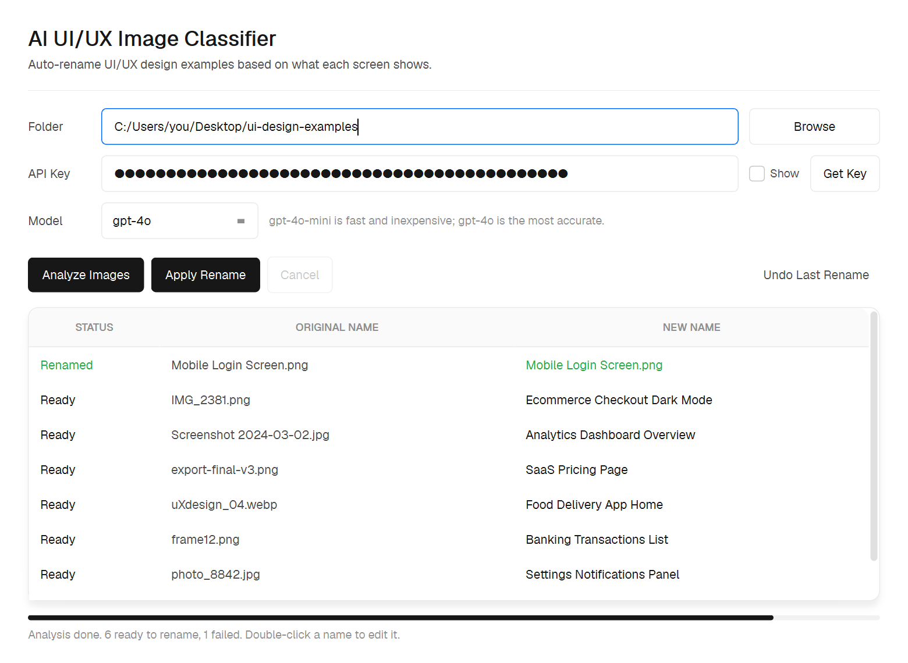

# AI UI/UX Image Classifier

> Point it at a folder of UI/UX design screenshots and it renames every file to
> a descriptive, human-readable name using an OpenAI vision model.

A small desktop app (PySide6 / Qt) that reads each image, suggests a clean
Title Case name like `Mobile Login Screen.png` or
`Ecommerce Checkout Dark Mode.png`, lets you preview and edit the names, then
renames them in one click. The interface is styled to Vercel's
[Geist](https://vercel.com/geist) (Light) design system.



<p align="center">
  
  
  
  
</p>

## Features

- **Folder in, clean names out** — pick a folder and batch-rename every image.
- **Preview before committing** — proposed names show in a table; double-click
  any name to edit it before applying.
- **Safe renaming** — auto-resolves name collisions (`… 2`, `… 3`), uses a
  two-phase move so swaps never lose files, and supports **Undo** for the last
  batch.
- **Fast** — analyzes up to 4 images in parallel; images are auto-oriented and
  downscaled before upload to keep it quick and cheap.
- **Tuned for UI/UX** — the prompt asks for screen type + product domain + a
  notable style/state (e.g. `SaaS Pricing Page`, `Banking Transactions List`).
- **Remembers** your folder, model, and API key between runs.

## Requirements

- Python 3.10 or newer (developed on 3.14)
- An OpenAI API key — create one at https://platform.openai.com/api-keys

## Install

```bash
git clone https://github.com/AdamJBurns/ai-uiux-image-classifier.git
cd ai-uiux-image-classifier
python -m venv .venv
# Windows:  .venv\Scripts\activate
# macOS/Linux:  source .venv/bin/activate
pip install -r requirements.txt
```

## Run

```bash
python app.py
```

1. Click **Browse** and choose your folder of UI/UX screenshots.
2. Paste your OpenAI API key (saved locally for next time).
3. Pick a model — `gpt-4o-mini` is fast and inexpensive; `gpt-4o` is the most
   accurate.
4. Click **Analyze Images**, then review and edit the proposed names.
5. Click **Apply Rename**. Use **Undo Last Rename** if you change your mind.

## Supported image types

`.png` `.jpg` `.jpeg` `.webp` `.gif` `.bmp` `.tiff`

## How it works

1. Each image is opened with Pillow, EXIF-rotated, downscaled to a 768px longest
   edge, and re-encoded as JPEG to keep the upload small.
2. It's sent to the OpenAI Chat Completions API (`detail: "low"`) with a system
   prompt tuned for naming UI/UX screens.
3. The reply is sanitized into a safe filename, de-duplicated against the folder,
   and applied with a two-phase rename that records an undo log.

## Project structure

```
app.py            # PySide6 GUI + Geist stylesheet, threading, apply/undo
classifier.py     # GUI-free core: image prep, OpenAI call, safe rename/undo
smoke_test.py     # offline test of the rename logic (no API calls)
requirements.txt  # dependencies
docs/screenshot.png
```

## Run the tests

The core rename logic is covered by an offline smoke test that needs no API key:

```bash
python smoke_test.py
```

## Build a standalone executable (optional)

You can produce a single-file app with [PyInstaller](https://pyinstaller.org/):

```bash
pip install pyinstaller
pyinstaller --noconfirm --windowed --name "AI Image Classifier" \
  --collect-all PySide6 app.py
```

The bundled app appears in `dist/`. (Qt apps are large; expect a sizeable
binary.)

## Privacy & notes

- Your API key is stored in plain text at `~/.ui_image_classifier/config.json`
  for convenience. Delete that file to clear it. It is **not** committed to git.
- Only files directly inside the chosen folder are processed; subfolders are
  left untouched.
- Each image is uploaded to OpenAI for analysis, so an internet connection and
  API credits are required.

## Contributing

Issues and pull requests are welcome. For larger changes, open an issue first to
discuss what you'd like to change. Please keep the core logic in `classifier.py`
GUI-free so it stays testable.

## License

[MIT](LICENSE) 
